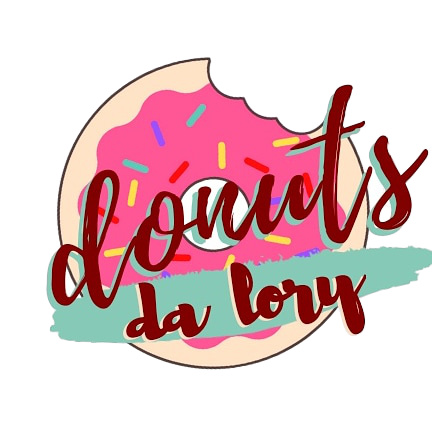
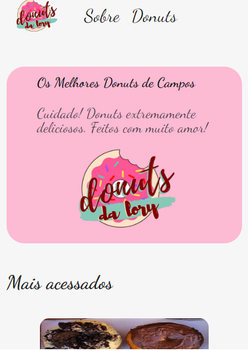
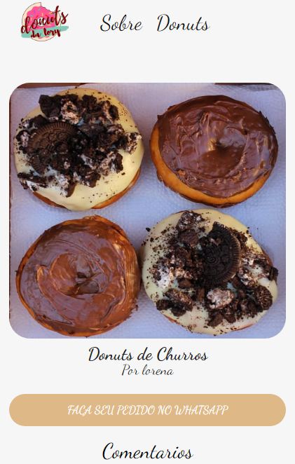
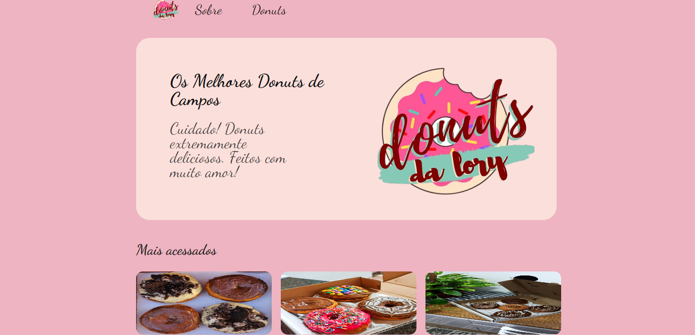
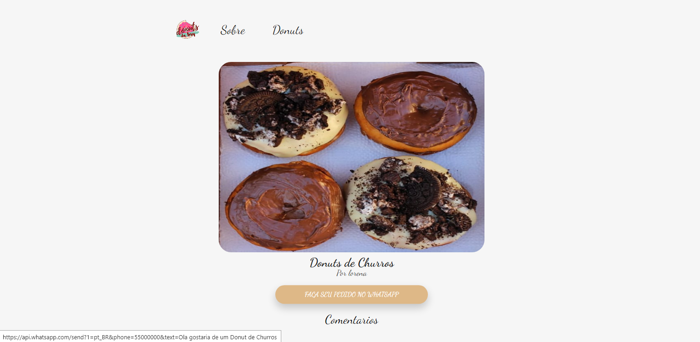

<h1 align="center">
    
</h1>

<h4 align="center"> 
	🚧 Donuts Da Lory 🍩 em construção... 🚧
</h4>

<p align="center">
  

  

  	
  <a href="https://www.linkedin.com/in/daniel-teixeira-71351b1a7/">
    
  </a>
	
  
  <a href="https://github.com/DanielTeixeiraa/Donuts-da-lory/commits/master">
    
  </a>

  
   <a href="https://github.com/DanielTeixeiraa/Donuts-da-lory/stargazers">
    
  </a>
</p>


## 💻 Sobre o projeto

🍩Donuts Da Lory - Primeiro site que eu faço para treinar meus conhecimentos em HTML, CSS, JavaScript e Node, como também um pouco de responsividade(nao sabendo nada quando comecei) usando como layout o foodfy. Com objetivo de complementar o negócio de donuts de uma amiga.


Funcionalidades:
- Listar todos os Donuts
- Pagina sobre o negócio
- Uma pagina para cada Donuts
  - Informações sobre o mesmo
  - Comentários de alguns clientes
  - Botão para mandar menssagem direto para o Whatsapp


### Web(mobile)

<p align="center" style="display: flex; align-items: flex-start; justify-content: center;">  
  
</p>
<p align="center">  
  
</p>

### Web

<p align="center"

 

 
</p>

## 🛠 Tecnologias

As seguintes ferramentas foram usadas na construção do projeto:

- [Node.js][nodejs]
- [JavaScript][js]
- [CSS][css]
- [HTML][html]


## 🚀 Como rodar este projeto

Podemos considerar este projeto como sendo divido em duas partes:
1. [Back End][server] 
2. [Front end][views]


### Pré-requisitos

Antes de começar, você vai precisar ter instalado em sua máquina as seguintes ferramentas:
[Git](https://git-scm.com), [Node.js][nodejs]. 
Além disto é bom ter um editor para trabalhar com o código como [VSCode][vscode]

### 🎲 Rodando a aplição

```bash
# Clone este repositório
$ git clone https://github.com/DanielTeixeiraa/Donuts-da-lory

# Acesse a pasta do projeto no terminal/cmd
$ cd Donuts-da-lory

# Vá para a pasta server
$ cd server

# Instale as dependências
$ npm install

# Execute a aplicação em modo de desenvolvimento
$ npm start

# O servidor inciará na porta:5000 - acesse http://localhost:5000 
```

## 😯 Como contribuir para o projeto

1. Faça um **fork** do projeto.
2. Crie uma nova branch com as suas alterações: `git checkout -b my-feature`
3. Salve as alterações e crie uma mensagem de commit contando o que você fez: `git commit -m "feature: My new feature"`
4. Envie as suas alterações: `git push origin my-feature`
> Caso tenha alguma dúvida confira este [guia de como contribuir no GitHub](https://github.com/firstcontributions/first-contributions)


## 📝 Licença

Este projeto esta sobe a licença MIT. Veja a [LICENÇA](license) para saber mais.

Feito com ❤️ por Daniel Teixeira 👋🏽 [Entre em contato!](https://www.linkedin.com/in/daniel-teixeira-71351b1a7/)


[server]: https://github.com/DanielTeixeiraa/Donuts-da-lory/tree/master/server
[views]: https://github.com/DanielTeixeiraa/Donuts-da-lory/tree/master/views
[html]: https://www.w3schools.com/html/
[css]: https://www.w3schools.com/css/
[js]: https://www.w3schools.com/js/
[nodejs]: https://nodejs.org/
[yarn]: https://yarnpkg.com/
[vscode]: https://code.visualstudio.com/
[vceditconfig]: https://marketplace.visualstudio.com/items?itemName=EditorConfig.EditorConfig
[license]: https://opensource.org/licenses/MIT
[vceslint]: https://marketplace.visualstudio.com/items?itemName=dbaeumer.vscode-eslint
[prettier]: https://marketplace.visualstudio.com/items?itemName=esbenp.prettier-vscode
